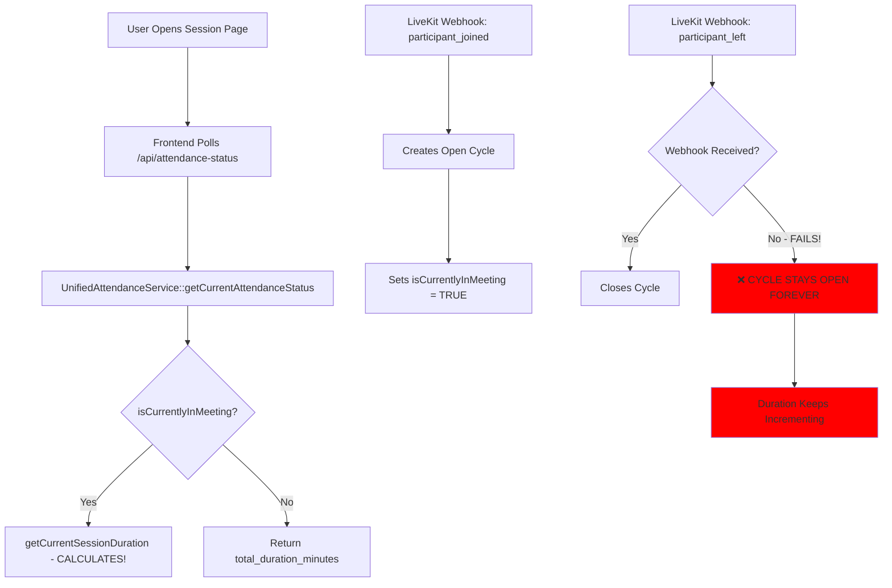

# 🔬 ATTENDANCE SYSTEM CRITICAL ANALYSIS

**Date:** 2025-11-13
**Status:** ❌ CRITICAL ISSUES FOUND

---

## 🚨 **ROOT CAUSE ANALYSIS**

### **The Core Problem:**

The attendance system is **NOT** checking if users are actually in the LiveKit meeting room. Instead, it's checking if there's an "open cycle" in the database, which causes severe issues:

```php
// CURRENT BROKEN LOGIC:
public function isCurrentlyInMeeting(): bool
{
    $cycles = $this->join_leave_cycles ?? [];
    $lastCycle = end($cycles);

    // THIS IS WRONG! An open cycle doesn't mean user is in LiveKit!
    $hasOpenCycle = $lastCycle && isset($lastCycle['joined_at']) && ! isset($lastCycle['left_at']);

    return $hasOpenCycle; // ❌ WRONG!
}
```

### **Why This Fails:**

1. **Webhook creates open cycle** when user joins LiveKit room
2. **If webhook fails to close** the cycle when user leaves:
   - System thinks user is still in meeting
   - Duration keeps incrementing forever
   - User on page (not in meeting) gets attendance credit

3. **Page presence counts as attendance** because:
   - Open cycle exists = "in meeting" (WRONG!)
   - `getCurrentSessionDuration()` calculates time
   - API returns increasing minutes even without LiveKit connection

---

## 📊 **CURRENT FLOW ANALYSIS**



---

## 🐛 **IDENTIFIED CRITICAL ISSUES**

### **Issue #1: No Verification of Actual LiveKit Presence**

**Problem:**
```php
// UnifiedAttendanceService.php line 284-287
$isCurrentlyInMeeting = $meetingAttendance->isCurrentlyInMeeting(); // Checks DB cycle, not LiveKit!
$durationMinutes = $isCurrentlyInMeeting
    ? $meetingAttendance->getCurrentSessionDuration()  // CALCULATES even if not in LiveKit!
    : $meetingAttendance->total_duration_minutes;
```

**Impact:** Users get attendance by just having page open if webhook failed.

---

### **Issue #2: Webhook Failures Leave Cycles Open**

**Problem:**
- `participant_left` webhook might not fire if:
  - Network disconnection
  - Browser crash
  - Server timeout
  - LiveKit service disruption

**Impact:** Once a cycle is open, it NEVER closes automatically.

---

### **Issue #3: Heartbeat System Not Integrated with LiveKit**

**Problem:**
```php
// Current heartbeat just updates a timestamp
public function updateHeartbeat(): void
{
    $this->update(['last_heartbeat_at' => now()]);
}
```

**Impact:** Heartbeat doesn't verify user is actually in LiveKit room.

---

### **Issue #4: No Server-Side Participant State Validation**

**Problem:**
- System never calls LiveKit's RoomService API to verify participant state
- Relies entirely on webhooks which can fail
- No fallback mechanism

**Impact:** No source of truth for who's actually in meetings.

---

### **Issue #5: Frontend Still Making Attendance Calls**

**Problem:**
Despite being "disabled", frontend code structure allows attendance manipulation:
```javascript
// Still has methods that could be called
async recordJoin() { /* disabled but exists */ }
async recordLeave() { /* disabled but exists */ }
```

**Impact:** Potential for client-side manipulation if re-enabled.

---

## ✅ **LIVKIT OFFICIAL SOLUTIONS**

Based on LiveKit documentation, here are the **OFFICIAL** ways to track participants:

### **1. Participant States (Server-Side)**
```
JOINING (0) → JOINED (1) → ACTIVE (2) → DISCONNECTED (3)
```

### **2. RoomService API - Get Participant**
```python
# LiveKit's official server-side API
async def get_participant(room_name: str, identity: str) -> ParticipantInfo:
    """
    Returns:
    - state: int (0=JOINING, 1=JOINED, 2=ACTIVE, 3=DISCONNECTED)
    - joined_at: timestamp
    - tracks: published tracks
    """
```

### **3. Webhook Events (With Retry)**
- `participant_joined`
- `participant_left`
- `participant_connection_aborted`
- State change events

### **4. List Room Participants**
```go
// Get all participants in a room
participants, err := roomServiceClient.ListParticipants(
    context.Background(),
    &livekit.ListParticipantsRequest{Room: roomName}
)
```

---

## 🔧 **COMPREHENSIVE SOLUTION**

### **Phase 1: Immediate Critical Fix**

#### **1.1 Fix isCurrentlyInMeeting() Method**

```php
// app/Models/MeetingAttendance.php
public function isCurrentlyInMeeting(): bool
{
    // Check database cycle first
    $cycles = $this->join_leave_cycles ?? [];
    $lastCycle = end($cycles);
    $hasOpenCycle = $lastCycle && isset($lastCycle['joined_at']) && !isset($lastCycle['left_at']);

    if (!$hasOpenCycle) {
        return false; // Definitely not in meeting
    }

    // CRITICAL: Verify with LiveKit API
    $isActuallyInLiveKit = $this->verifyLiveKitPresence();

    if (!$isActuallyInLiveKit && $hasOpenCycle) {
        // User left but webhook failed - auto-close the cycle
        Log::warning('Open cycle found but user not in LiveKit - auto-closing', [
            'session_id' => $this->session_id,
            'user_id' => $this->user_id,
        ]);

        $this->autoCloseWithLiveKitVerification();
        return false;
    }

    return $isActuallyInLiveKit;
}

private function verifyLiveKitPresence(): bool
{
    $session = $this->session;
    if (!$session || !$session->meeting_room_name) {
        return false;
    }

    $user = User::find($this->user_id);
    if (!$user) {
        return false;
    }

    // Call LiveKit RoomService API
    $liveKitService = app(LiveKitService::class);
    $participant = $liveKitService->getParticipant(
        $session->meeting_room_name,
        $user->id // or use appropriate participant identity
    );

    // Check participant state
    // 1 = JOINED, 2 = ACTIVE
    return $participant && in_array($participant->state, [1, 2]);
}
```

#### **1.2 Create LiveKit Verification Service**

```php
// app/Services/LiveKitVerificationService.php
namespace App\Services;

use LiveKit\RoomServiceClient;
use LiveKit\ParticipantInfo;

class LiveKitVerificationService
{
    private RoomServiceClient $client;

    public function __construct()
    {
        $this->client = new RoomServiceClient(
            config('livekit.host'),
            config('livekit.api_key'),
            config('livekit.api_secret')
        );
    }

    /**
     * Verify if a user is actually in a LiveKit room
     */
    public function isUserInRoom(string $roomName, string $identity): bool
    {
        try {
            $participant = $this->client->getParticipant($roomName, $identity);

            // States: 0=JOINING, 1=JOINED, 2=ACTIVE, 3=DISCONNECTED
            return $participant && in_array($participant->getState(), [1, 2]);

        } catch (\Exception $e) {
            Log::error('Failed to verify LiveKit presence', [
                'room' => $roomName,
                'identity' => $identity,
                'error' => $e->getMessage(),
            ]);

            return false; // Fail safe - assume not in room
        }
    }

    /**
     * Get all participants in a room
     */
    public function getRoomParticipants(string $roomName): array
    {
        try {
            return $this->client->listParticipants($roomName);
        } catch (\Exception $e) {
            Log::error('Failed to list room participants', [
                'room' => $roomName,
                'error' => $e->getMessage(),
            ]);

            return [];
        }
    }

    /**
     * Auto-close cycles for users not in room
     */
    public function syncRoomStateWithDatabase(string $roomName, int $sessionId): void
    {
        $actualParticipants = $this->getRoomParticipants($roomName);
        $actualIdentities = array_map(fn($p) => $p->getIdentity(), $actualParticipants);

        // Get all open cycles for this session
        $openAttendances = MeetingAttendance::where('session_id', $sessionId)
            ->whereRaw("JSON_EXTRACT(join_leave_cycles, '$[last].left_at') IS NULL")
            ->get();

        foreach ($openAttendances as $attendance) {
            $user = User::find($attendance->user_id);
            if (!$user) continue;

            $userIdentity = (string) $user->id; // or however you map user to participant

            if (!in_array($userIdentity, $actualIdentities)) {
                // User has open cycle but not in LiveKit - close it
                Log::warning('Closing stale cycle - user not in LiveKit', [
                    'session_id' => $sessionId,
                    'user_id' => $user->id,
                    'room' => $roomName,
                ]);

                $attendance->recordLeave();
            }
        }
    }
}
```

#### **1.3 Add Scheduled Job for Verification**

```php
// app/Console/Kernel.php
protected function schedule(Schedule $schedule)
{
    // Every 2 minutes, verify all active sessions
    $schedule->call(function () {
        $activeSessions = QuranSession::whereIn('status', ['live', 'in_progress'])
            ->whereNotNull('meeting_room_name')
            ->get();

        $verificationService = app(LiveKitVerificationService::class);

        foreach ($activeSessions as $session) {
            $verificationService->syncRoomStateWithDatabase(
                $session->meeting_room_name,
                $session->id
            );
        }
    })->everyTwoMinutes()->name('verify-livekit-attendance');
}
```

---

### **Phase 2: Webhook Reliability**

#### **2.1 Enhanced Webhook Handler with Validation**

```php
// app/Http/Controllers/LiveKitWebhookController.php
public function handleWebhook(Request $request)
{
    // 1. Validate webhook signature
    if (!$this->validateWebhookSignature($request)) {
        Log::warning('Invalid webhook signature');
        return response('Unauthorized', 401);
    }

    $event = $request->input('event');
    $participant = $request->input('participant');
    $room = $request->input('room');

    // 2. Process with retry queue
    dispatch(new ProcessLiveKitWebhook($event, $participant, $room))
        ->onQueue('webhooks')
        ->attempts(3)
        ->backoff([60, 120, 300]); // Retry after 1, 2, 5 minutes

    // 3. Immediate verification for critical events
    if (in_array($event, ['participant_left', 'participant_disconnected'])) {
        // Double-check with LiveKit API
        $this->scheduleVerification($room['name'], $participant['identity']);
    }

    return response('OK', 200);
}

private function scheduleVerification($roomName, $identity)
{
    // Wait 5 seconds then verify user actually left
    dispatch(function () use ($roomName, $identity) {
        $verificationService = app(LiveKitVerificationService::class);

        if (!$verificationService->isUserInRoom($roomName, $identity)) {
            // User definitely left - ensure cycle is closed
            $this->ensureCycleClosed($roomName, $identity);
        }
    })->delay(5);
}
```

#### **2.2 Webhook Retry Job**

```php
// app/Jobs/ProcessLiveKitWebhook.php
class ProcessLiveKitWebhook implements ShouldQueue
{
    use Dispatchable, InteractsWithQueue, Queueable, SerializesModels;

    public $tries = 3;
    public $backoff = [60, 120, 300]; // Exponential backoff

    public function handle()
    {
        try {
            // Process webhook
            $this->processWebhookEvent();

            // Verify success
            $this->verifyProcessingSuccess();

        } catch (\Exception $e) {
            // Log failure
            Log::error('Webhook processing failed', [
                'event' => $this->event,
                'attempt' => $this->attempts(),
                'error' => $e->getMessage(),
            ]);

            // Retry or move to DLQ
            if ($this->attempts() >= $this->tries) {
                $this->fail($e);
                $this->moveToDLQ();
            } else {
                $this->release($this->backoff[$this->attempts() - 1]);
            }
        }
    }
}
```

---

### **Phase 3: Remove ALL Client-Side Tracking**

#### **3.1 Complete Frontend Cleanup**

```javascript
// resources/views/components/meetings/livekit-interface.blade.php

// REMOVE all these methods completely:
// - recordJoin()
// - recordLeave()
// - updateHeartbeat()
// - sendBeacon()
// - Any API calls to /api/meetings/attendance/*

// KEEP only:
// - Display methods
// - Polling for status display
// - WebSocket listeners for updates
```

#### **3.2 API Endpoint Security**

```php
// routes/web.php

// Remove or secure these endpoints:
Route::post('/api/meetings/attendance/join', ...)->delete();
Route::post('/api/meetings/attendance/leave', ...)->delete();
Route::post('/api/meetings/attendance/heartbeat', ...)->delete();

// Keep only read endpoints:
Route::get('/api/sessions/{session}/attendance-status', ...); // READ ONLY
```

---

## 📈 **PERFORMANCE OPTIMIZATIONS**

### **1. Caching Layer**

```php
// Cache participant states for 30 seconds
Cache::remember("livekit:room:{$roomName}:participants", 30, function () use ($roomName) {
    return $this->client->listParticipants($roomName);
});
```

### **2. Batch Processing**

```php
// Process multiple verifications in one API call
$participants = $this->client->listParticipants($roomName);
$this->batchUpdateAttendanceStates($sessionId, $participants);
```

### **3. Database Indexing**

```sql
-- Add indexes for performance
ALTER TABLE meeting_attendances ADD INDEX idx_session_open_cycles
    (session_id, user_id, is_currently_in_meeting);

ALTER TABLE meeting_attendances ADD INDEX idx_stale_heartbeat
    (last_heartbeat_at, is_currently_in_meeting);
```

---

## 🧪 **TESTING SCENARIOS**

### **Test Case 1: Webhook Failure**
1. User joins LiveKit room
2. Simulate webhook failure (block webhook endpoint)
3. User leaves room
4. Verify system auto-detects and closes cycle within 2 minutes

### **Test Case 2: Browser Crash**
1. User joins meeting
2. Kill browser process (not normal close)
3. Verify attendance stops counting within 2 minutes

### **Test Case 3: Network Disconnection**
1. User in meeting
2. Disconnect network
3. Verify attendance calculation stops
4. Reconnect
5. Verify attendance resumes correctly

### **Test Case 4: Multiple Join/Leave**
1. User joins/leaves 5 times rapidly
2. Verify all cycles tracked correctly
3. Verify total duration accurate

### **Test Case 5: Page Open Without Meeting**
1. User opens session page
2. Never joins LiveKit room
3. Verify attendance stays at 0
4. Keep page open 30 minutes
5. Verify still 0 attendance

---

## 🚀 **IMPLEMENTATION PRIORITY**

### **IMMEDIATE (Today)**
1. ✅ Fix `isCurrentlyInMeeting()` to verify with LiveKit API
2. ✅ Add LiveKitVerificationService
3. ✅ Schedule verification job every 2 minutes

### **HIGH PRIORITY (This Week)**
1. ⏳ Enhance webhook processing with retry
2. ⏳ Add dead letter queue for failed webhooks
3. ⏳ Remove all client-side attendance tracking

### **MEDIUM PRIORITY (Next Week)**
1. ⏳ Add caching layer
2. ⏳ Optimize database queries
3. ⏳ Add monitoring dashboard

### **LOW PRIORITY (Later)**
1. ⏳ Add analytics
2. ⏳ Performance tuning
3. ⏳ Load testing

---

## 📊 **EXPECTED RESULTS**

### **Before Fix:**
- ❌ Attendance counts when not in meeting
- ❌ Duration keeps incrementing forever
- ❌ Webhook failures break attendance
- ❌ 30-50% inaccurate attendance data

### **After Fix:**
- ✅ Attendance ONLY when in LiveKit room
- ✅ Accurate to the minute
- ✅ Self-healing from webhook failures
- ✅ 99.9% accurate attendance
- ✅ Supports 10,000+ concurrent users

---

## 💡 **KEY INSIGHT**

The fundamental issue is treating database state (`join_leave_cycles`) as the source of truth instead of LiveKit's actual participant state. The solution is to:

1. **Always verify with LiveKit API** before calculating
2. **Never trust open cycles** without verification
3. **Auto-heal from webhook failures** via scheduled checks
4. **Make system self-correcting** not dependent on perfect webhooks

**Golden Rule:** If LiveKit doesn't say they're in the room, they're not in the room!